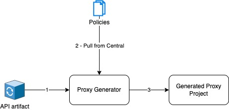
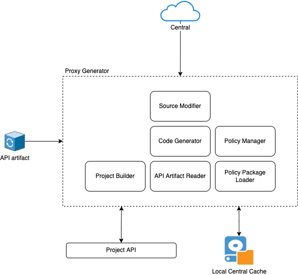

# Mediation Service Generator

## Overview
Given an Open API definition and an API metadata file, this tool will generate a Ballerina service with the mediations
specified in the API metadata file.

High level flow



Main components



### High Level Flow
- Run the tool with the API artifact and the Ballerina distribution as the args
- Create a Ballerina project for the mediation service
- Read the OpenAPI definition and generate the service stub for it
- Read the `api.yaml` file and create the model for it
- Use the model created above to derive the policies that need to be pulled from Central and pull them
- Add the boilerplate code to the service source file
- Parse the service file and get the syntax tree
- Traverse through the resource methods and create code snippets to be inserted in the method bodies and collect these
- Apply the text edits collected in the previous step to the service file
- Write the file modifications to the disk

## Requirements

- JDK 11
- Ballerina 2201.1.0
- Maven 3.8.0

## Build

- Add an entry for GitHub packages in the servers section in your Maven `settings.xml` file.

```xml

<server>
    <id>github-packages</id>
    <username><!--<GitHub username>--></username>
    <password><!--GitHub Personal Access Token --></password>
</server> 
```

- Run `mvn clean install` from the project root

## Usage

The build produces a stand-alone executable JAR file in the `/target` directory. You can run this JAR as follows:

```
$ java -jar target/proxy-generator-<version>-jar-with-dependencies.jar $(bal home) <path-to-the-API-artifact-zip>
```

## Sample

A bare minimum API artifact required for the generation would looks something like the following:

- The OpenAPI definition:

```yaml
openapi: 3.0.0
info:
    title: PizzaShackAPI
    version: 1.0.0
servers:
    -   url: https://localhost:8243/pizzashack/1.0.0/
paths:
    /menu:
        get:
            description: Return a list of available menu items
            responses:
                '200':
                    description: OK. List of pizzas is returned.
                    content:
                        application/json:
                            schema:
                                type: array
                                items:
                                    $ref: '#/components/schemas/MenuItem'
components:
    schemas:
        MenuItem:
            title: Pizza menu Item
            required:
                - name
            properties:
                price:
                    type: string
                description:
                    type: string
                name:
                    type: string
                image:
                    type: string
```

- The `api.yaml` API metadata file:

```yaml
type: api
version: v4.1.0
data:
    operations:
        -   id: ""
            target: /menu
            verb: GET
            operationPolicies:
                request:
                    -   policyName: pubudu/addHeader
                        policyVersion: 0.0.2
                        policyId: c0e54efb-329e-4ac2-9322-4515d6f5ca37
                        parameters:
                            headerName: Fizz
                            headerValue: Fuzz
                response:
                    -   policyName: pubudu/addHeader
                        policyVersion: 0.0.2
                        policyId: c0e54efb-329e-4ac2-9322-4515d6f5ca37
                        parameters:
                            headerName: Foo
                            headerValue: Bar
                    -   policyName: pubudu/addHeader
                        policyVersion: 0.0.2
                        policyId: c0e54efb-329e-4ac2-9322-4515d6f5ca37
                        parameters:
                            headerName: Baz
                            headerValue: Qaz 
```

The directory structure should be as follows:

```
PizzaShackAPI
|-- Definitions
|   |-- swagger.yaml
|-- api.yaml    
```

For the above definitions, currently this tool will generate the following:

```ballerina
import pubudu/addHeader;
import ballerina/http;

listener http:Listener ep0 = new (8243, config = {host: "localhost"});

service /pizzashack/'1\.0\.0 on ep0 {
    resource function get menu(http:Caller caller, http:Request incomingRequest) returns error? {
        do {
            {
                var x = check addHeader:addHeader_In(incomingRequest);

                if x is false {
                    http:Response res1 = createAcceptedResponse();
                    http:ListenerError? response = caller->respond(res1);
                    return;
                } else if x is http:Response {
                    http:ListenerError? response = caller->respond(x);
                    return;
                }
            }

            map<string|string[]> updatedHeaders = copyRequestHeaders(incomingRequest);
            http:Response backendResponse = check backendEP->get("...", updatedHeaders);

            {
                var x = check addHeader:addHeader_Out(backendResponse, incomingRequest);

                if x is false {
                    // handle stopping mediation midway
                    return;
                } else if x is http:Response {
                    http:ListenerError? response = caller->respond(x);
                    return;
                }
            }

            {
                var x = check addHeader:addHeader_Out(backendResponse, incomingRequest);

                if x is false {
                    // handle stopping mediation midway
                    return;
                } else if x is http:Response {
                    http:ListenerError? response = caller->respond(x);
                    return;
                }
            }

            check caller->respond(backendResponse);
        } on fail var e {
            http:Response errFlowResponse = createDefaultErrorResponse(e);
            check caller->respond(errFlowResponse);
        }
    }
}

final http:Client backendEP = check new ("http://localhost:9090");

function createDefaultErrorResponse(error e) returns http:Response {
    return new;
}

function createAcceptedResponse() returns http:Response {
    return new;
}

function copyRequestHeaders(http:Request req) returns map<string|string[]> {
    map<string|string[]> headers = {};
    string[] headerNames = req.getHeaderNames();
    foreach string name in headerNames {
        string[]|http:HeaderNotFoundError headersResult = req.getHeaders(name);

        if headersResult is string[] {
            if headersResult.length() == 1 {
                headers[name] = headersResult[0];
            } else {
                headers[name] = headersResult;
            }
        }
    }
    return headers;
}
```